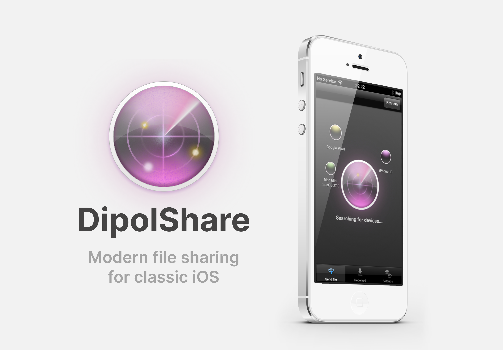

# DipolShare - LocalSend client for classic iOS (4.2+)

  

[LocalSend](https://localsend.org/) is an open-source cross-platform app for sharing files between nearby devices over a local network. It works without an account, cloud storage, or an internet connection.

DipolShare brings LocalSend-compatible sharing to classic iOS devices. You can send photos and videos from the device library, accept incoming files, and send or receive clipboard text with modern devices running LocalSend on **iOS, Android, Windows, Linux, and macOS**.

## Features

- Send and receive files and clipboard text
- Discover nearby LocalSend devices
- Browse received files in the app

## Compatibility

| Category | Supported |
| --- | --- |
| Supported OS | iOS 4.2+ |
| | iOS 5 |
| | iOS 6 |
| Architecture | ARMv6 (iPhone 3G, iPod touch 2nd generation) |
| | ARMv7 |

Both devices must be on the same local network.

## Security

DipolShare encrypts transfers with TLS 1.2 and keeps its private key in the iOS Keychain.

## Requirements

The app requires as a jailbroken iOS with AppSync installed.

TLSFix is not required.

## The app was tested on:

### these devices:

- iPhone 3GS/4S/5
- iPod touch 2g/4
- iPad 1st generation

### with these versions

- iOS 4.2.1
- iOS 5
- iOS 6

## Third-party software

- [OpenSSL 3.5.8](https://openssl-library.org/) — TLS support, licensed under [Apache 2.0](Vendor/OpenSSL/LICENSE-OpenSSL.txt).
- [JSONKit 1.4](https://github.com/johnezang/JSONKit) — JSON parsing, used under its [BSD license](Vendor/JSONKit/LICENSE-JSONKit.txt).

## Copyright

© 2026 Oleh Bespalov - Love is in the Tech. All rights reserved for DipolShare’s original code and artwork. Third-party components retain their respective licenses.
